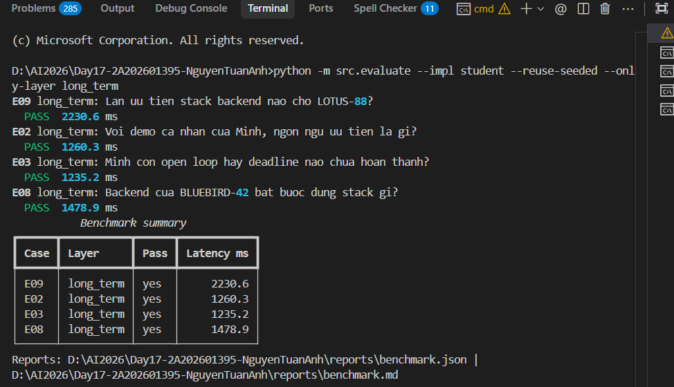
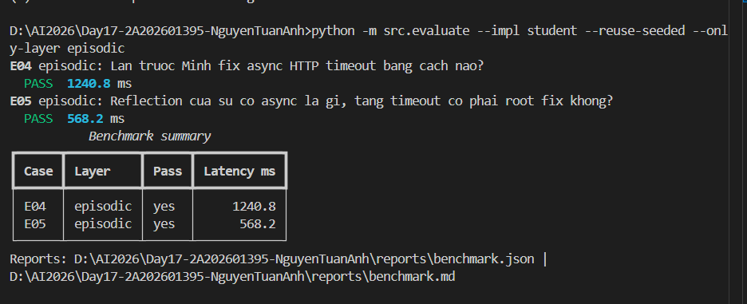
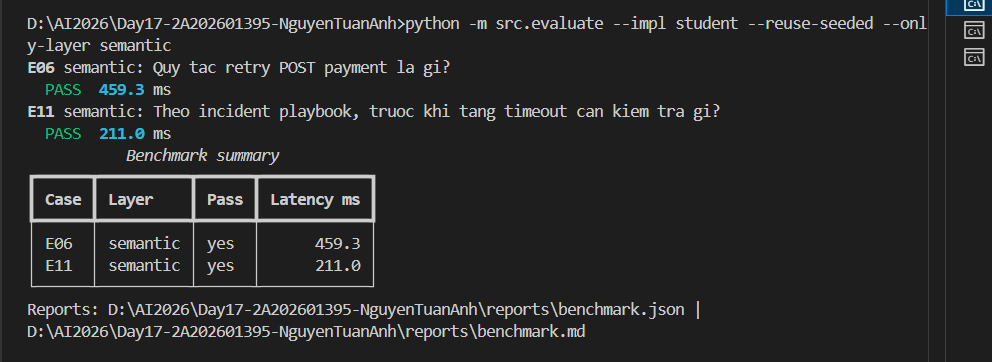
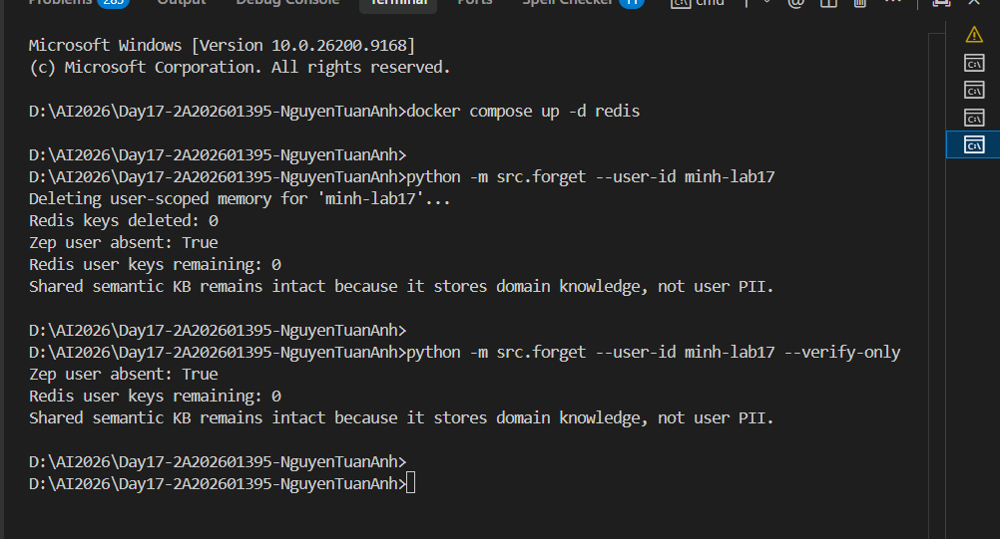

# Báo cáo Nộp bài Lab 17 - Zep Multi-Memory Agent

- **Họ tên**: Nguyễn Tuấn Anh | **MSSV**: 2A202601395
- **Kết quả Practice Benchmark**: **11/11 PASS (100% Hit Rate)**

---

## 1. Trả lời 3 Câu hỏi Lý thuyết

### Câu 1: Layer quan trọng nhất
**Long-term memory (Zep User Graph / Context Block)** là layer quan trọng nhất. Nó bao phủ 4/11 case practice (E02, E03, E08, E09) và case Mixed (E07), giúp recall thông tin cross-session, đảm bảo cô lập dữ liệu người dùng (E09), theo dõi open loops/deadlines (E03) và xử lý mâu thuẫn dữ liệu theo thời gian (E08).

### Câu 2: Trade-off Context Block (Zep) vs Redis + Qdrant
- **Managed Zep Context Block**: Tự động tổng hợp facts, entities, quan hệ và episode history theo `user_id` và `thread_id`. Giảm độ phức tạp phát triển nhưng phụ thuộc API bên thứ ba và có độ trễ mạng (~1s).
- **Redis + Qdrant**: Tốc độ xử lý cực nhanh (<1ms), linh hoạt lưu trữ local. Tuy nhiên phải tự xây dựng pipeline compaction, trích xuất thực thể, xử lý conflict và đảm bảo cách ly dữ liệu thủ công.

### Câu 3: Guardrail chống Memory Poisoning
1. **Consent Gate**: Bắt buộc opt-in (`consent.json`) trước khi lưu vết.
2. **User Isolation**: Truy vấn gán cứng `user_id`, ngăn chặn prompt injection đọc/sửa bộ nhớ người dùng khác.
3. **Sanitization**: Lọc bỏ instruction độc hại trong durable notes qua Heartbeat và Privacy Guard.

---

## 2. Phân tích kết quả Benchmark

1. **Hit rate thấp nhất**: Baseline `no-memory` đạt 0% ở các layer ngoài short-term. Bản `student` đạt **100% hit rate (11/11 PASS)**.
2. **Query nhiều token nhất**: `E03` (1359 tokens) và `E02` (1353 tokens) do Context Block tổng hợp toàn bộ `USER_SUMMARY` và episode history.
3. **Case Mixed (E07)**: Kết hợp **Long-term** (sở thích Python của Minh) và **Semantic** (`Idempotency-Key` từ domain KB). Evidence: `Python`, `Idempotency-Key`.
4. **Token Reduction**: Baseline reduction 81.8% vì không retrieve gì. Reduction chỉ có ý nghĩa khi Hit Rate cao (`student` đạt 100% hit rate, giảm 67-74% token ở semantic KB).

---

## 3. Phân tích Case Đặc biệt

- **E08 Recency**: Stack BLUEBIRD-42 đổi sang TypeScript/NestJS được Zep tự động cập nhật fact mới và ưu tiên sử dụng.
- **E10 Compaction**: `ShortTermMemory` nén lịch sử cũ nhưng bảo toàn `REVIEW-DEADLINE-1600` trong `DURABLE_NOTES`.

---

## 4. Hình ảnh Minh chứng (Evidence Screenshots)

- **Long-term Memory (E02, E03, E08, E09 PASS)**: 
- **Episodic Memory (E04, E05 PASS)**: 
- **Semantic Memory (E06, E11 PASS)**: 
- **Privacy Drill (Forget & Verify PASS)**: 
